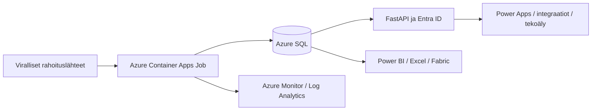

# Käyttöönotto Microsoft-ympäristöön

Tämä on kaupungin IT:n toteutettava käyttöönotto-ohje. Mukana on ajettava sovellus, SQL-migraatiot ja tarkistettava Azure Bicep -infrastruktuuri. Azure-tilaus, Entra-ryhmät, verkkoyhteydet ja kaupungin hyväksymä ylläpitovastuu täytetään käyttöönotossa. Toimitus ei sisällä pilveen luotuja resursseja.

## Rakenne



Tietokanta on yksityisessä verkossa. API:n HTTPS-liikenne voi olla julkisesti saavutettavissa, mutta tietojen lukeminen ja muokkaaminen vaativat oikean Entra-tokenin ja sovellusroolin. Julkiset terveystarkistukset eivät paljasta sisältöä. Tietokantaa lukeva Power BI tarvitsee tässä mallissa kaupungin verkkoyhteyden ja soveltuvan data gatewayn tai VNet data gatewayn. Gatewayn kapasiteetti ja lisenssit valitaan kaupungin mallin mukaan.

## 1. Entra ja konttirekisteri

Luo saman tenantin sovellusrekisteröinti API:lle. Aseta `requestedAccessTokenVersion=2`, määritä sovellusroolit `Funding.Read` ja `Funding.Review` sekä tarvittaessa saman nimiset delegoidut scopet. Anna vain lukurooli raportoiville sovelluksille. Anna arviointirooli hyväksytyille ylläpitäjille. Molemmat roolit voidaan antaa samalle käyttäjälle. Roolien myöntäminen on kaupungin identiteetinhallinnan tehtävä.

Kirjaa API:n application/client ID parametriksi `apiAudience`. Tokenin `aud`-arvon on vastattava sitä täsmälleen. Määritä SQL:n pääkäyttäjäksi kaupungin Entra-ryhmä; kerää ryhmän object ID ja nimi.

Luo Azure Container Registry kaupungin hyväksymään resurssiryhmään. Rakenna Linux amd64 -kuva:

```sh
az acr build --registry REGISTRY_NAME --platform linux/amd64 --image funding-registry:RELEASE_ID .
```

Käytä julkaisussa imagen digest-viitettä. Lukittu Python-riippuvuusjoukko asennetaan hash-tarkistuksin. Käytössä ovat Microsoftin virallinen ODBC 18 -ajuri ja TLS-sertifikaattien tarkistus. Päivitä myös konttien peruskuvat normaalissa ylläpitorytmissä ja testaa päivitykset.

## 2. Infrastruktuurin perusta

Kopioi `infra/parameters.example.json` kaupungin omaan parametrikansioon ja täytä kaikki `REPLACE`-arvot. Valitse kaupungin hyväksymä EU-alue sekä osoiteavaruus, joka ei mene päällekkäin olemassa olevien verkkojen kanssa. Esimerkin VNet on `10.64.0.0/16`. Tuotantoverkkoon liittäminen ja DNS-ratkaisu tarkistetaan ennen julkaisua.

```sh
az bicep build --file infra/main.bicep
az deployment group what-if --resource-group RESOURCE_GROUP --template-file infra/main.bicep --parameters @CITY_PARAMETERS.json
az deployment group create --resource-group RESOURCE_GROUP --name funding-foundation --template-file infra/main.bicep --parameters @CITY_PARAMETERS.json deployWorkloads=false enableDailySchedule=false
```

Pohja luo SQL-palvelimen ja tietokannan, yksityisen SQL-yhteyden DNS-tietoineen, Container Apps -ympäristön, Log Analyticsin ja kaksi hallittua identiteettiä. SQL sallii vain Entra-tunnistautumisen ja käyttää 14 päivän palautushistoriaa. Esimerkin SQL S0 on aloituskokoluokka, jonka suorituskyky ja kapasiteetti mitoitetaan todellisella datalla.

Anna molemmille hallituille identiteeteille `AcrPull`-rooli **vain käytettävän ACR:n tasolla**. Object ID:t saat deploymentin output-arvoista. Tämä oikeus ei anna SQL-oikeuksia.

```sh
az role assignment create --assignee-object-id COLLECTOR_OBJECT_ID --assignee-principal-type ServicePrincipal --role AcrPull --scope ACR_RESOURCE_ID
az role assignment create --assignee-object-id API_OBJECT_ID --assignee-principal-type ServicePrincipal --role AcrPull --scope ACR_RESOURCE_ID
```

## 3. Tietokannan migraatio ja aineiston siirto

Aja seuraavat komennot koneelta tai kaupungin julkaisuagentilta, joka saavuttaa yksityisen SQL-verkon. Kirjaudu SQL:n Entra-pääkäyttäjäryhmän jäsenenä (`az login`). Asenna ODBC 18 ja projektin Azure-riippuvuudet.

```sh
uv sync --frozen --extra azure
```

Aseta ympäristömuuttujat:

```sh
export FUNDING_AZURE_SQL_SERVER=YOUR_SERVER.database.windows.net
export FUNDING_AZURE_SQL_DATABASE=funding
```

PowerShellissa vastaava syntaksi on `$env:FUNDING_AZURE_SQL_SERVER="YOUR_SERVER.database.windows.net"`. Jätä `FUNDING_MANAGED_IDENTITY_CLIENT_ID` tyhjäksi omalla käyttöönottokoneella, jotta kirjautunut Entra-käyttäjä toimii migraatioidentiteettinä.

Toimitetun tietokannan siirto:

```sh
uv run alembic upgrade head
uv run funding transfer --from-url sqlite:///data/funding.db
```

Kohdetaulujen on oltava tyhjiä. Älä aja `funding init` ennen aineiston siirtoa, koska se täyttää lähdetaulun. Siirto säilyttää tunnisteet, versiot, lähteet, havainnot, määräajat, asiantuntija-arviot sekä asiakirjojen alkuperäistiedostot, kokotekstit ja viitteet. Pysäytä lähdetietokannan kirjoittajat siirron ajaksi. Tarkista siirron jälkeen taulukohtaiset määrät ja otanta sisällöstä.

Jos haluat aloittaa tyhjästä, käytä siirron sijaan `uv run funding init` ja aja ensimmäinen keruu julkaisun jälkeen.

Tuota hallittujen identiteettien SQL SID -arvot:

```sh
python scripts/sql_principals.py COLLECTOR_OBJECT_ID API_OBJECT_ID
```

Täytä `infra/bootstrap.sql`-tiedoston kaksi SID-paikkamerkkiä ja suorita skripti `funding`-tietokantaan SQL-pääkäyttäjänä. Se luo rajatut kerääjän ja API:n oikeudet. Migraatio-oikeuksia ei anneta kerääjälle. Lisää raportointiin tarkoitettu Entra-ryhmä `funding_reader`-rooliin.

## 4. Sovellus, koeajo ja päivittäinen ajo

Julkaise työkuormat ensin käsin ajettavalla keruulla:

```sh
az deployment group create --resource-group RESOURCE_GROUP --name funding-workloads --template-file infra/main.bicep --parameters @CITY_PARAMETERS.json deployWorkloads=true enableDailySchedule=false
az containerapp job start --resource-group RESOURCE_GROUP --name PREFIX-collect
```

Odota koeajon valmistuminen. Tarkista `funding health --check`, `funding coverage`, API:n `/v1/health`, lähdekohtaiset `expected/seen/rejected`-määrät ja Azure-lokit. `expected` on lähteen raakatietueiden määrä; EU:ssa usea raakatietue voi yhdistyä samaan hakuun, jolloin `seen` on pienempi. Epäonnistunut lähde ei saa näkyä tuoreena.

Tarkista Entra-suojat oikealla lukutokenilla ja arviointitokenilla. Testaa sekä luvallinen pääsy että väärän tenantin, puuttuvan roolin ja vanhentuneen tokenin hylkäys. Varmista, että Power BI:n verkko ja käyttäjä näkevät vain sovitut näkymät. Näitä tenant-kohtaisia kokeita ei voi tehdä tämän toimituksen paikallisessa ympäristössä.

Ota lopuksi päivittäinen ajo käyttöön:

```sh
az deployment group create --resource-group RESOURCE_GROUP --name funding-daily --template-file infra/main.bicep --parameters @CITY_PARAMETERS.json deployWorkloads=true enableDailySchedule=true
```

Ajastus on klo **03.00 UTC** joka päivä. Tämä tarkoittaa Suomessa klo 05.00 talvella ja 06.00 kesällä. Job ei pidä palvelinta jatkuvasti käynnissä keruuta varten. Sovellus estää päällekkäiset keruut tietokantaan tallennettavalla määräaikaisella lukolla. Epäonnistumisesta tehdään yksi automaattinen uusintayritys. Yksittäisiä lähteitä voi ajaa uudelleen komentoriviltä.

## 5. Power BI, Excel, Power Apps ja Fabric

Koko asiakirjakytkentöjen aineisto ylittää Excel-laskentataulukon **1 048 576 rivin rajan**. Lataa laaja `PowerQuery-Documents`-tulos Power BI:n tietomalliin, tuettuun Excelin tietomalliin tai rajaa kyselyä ennen laskentataulukkoon lataamista. Tarkista tietomallin saatavuus ja muistirajat käytettävässä Excel-versiossa. Mukana toimitettava hakujen Excel-poiminta on tavallinen, suodatettava taulukko; sen hakukohtaiset linkit avaavat erilliset asiakirjaluettelot. [Microsoft: Power Queryn rajat](https://support.microsoft.com/en-us/excel/power-query-specifications-and-limits-in-excel), [tietomallin rajat](https://support.microsoft.com/en-us/excel/data-model-specification-and-limits).

**Power BI / Excel:** Hae tiedot → Azure SQL Database → palvelin ja tietokanta → Microsoft/organisaatiotilin kirjautuminen. Valitse `v_funding`, `v_funding_tags`, `v_source_health` ja `v_funding_documents`. Vaihtoehtoisesti liitä valmiit `integrations/PowerQuery-*.m`-kyselyt Advanced Editoriin ja vaihda palvelimen nimi.

Yhdistä `Funding[id]` ja `Tags[opportunity_id]` suhteella 1:n. Teema- ja aluesuodatus tarvitsee mallissa hallitun suodatussuunnan tai erillisen siltataulun. Lisää slicereiksi **rahoittaja**, **tietuetyyppi (`record_kind`)**, rahoituksen laji, ohjelma, teema, hakutila, määräaika, palvelualue, hakukelpoisuus ja tarkistustarve. Näytä lähteiden tuoreus raportilla. Määräaikasarake on viimeinen ilmoitettu vaihe; kaikki vaiheet löytyvät `deadlines`-taulusta. Myöhempi hakuvaihe ei yksin tarkoita, että uusi hakija voi vielä osallistua.

Valmis Power Query säilyttää myös rahoitusmuodot ja tuntemattomassa tilassa olevat hakuehdokkaat. Rajaa `record_kind=call` ja `effective_status=open` vain silloin, kun tarvitset avoimia hakukierroksia. `funding_scheme` näyttää myös säätiöiden toistuvat apurahat, lainat ja muut rahoitusreitit. Tuntematon tila ei tarkoita avointa hakua. Rahoittajakohtaiset määrät voi ryhmitellä Power BI:ssä tai lukea API:n `/v1/funders`-toiminnosta.

Version 0.4 suodattimet ovat `priority=1`…`priority=12` sekä `cascade=true` / `cascade=false`. Esimerkkejä: `/v1/opportunities?priority=8`, `/v1/opportunities?cascade=true&status=open` ja `/v1/opportunities?priority=9&record_kind=call`. `GET /v1/priorities` palauttaa ryhmien määrät, rajaukset ja lähteiden tilat. Sivutus käyttää samoja `limit`- ja `offset`-parametreja kuin muut haut. `record_kind=advance_information` näyttää esimerkiksi MYR:n valmistelutiedot. Tämä on API 1.0:n yhteensopiva laajennus eikä vaadi uutta tietokantaskeemaa.

`PowerQuery-AzureSQL.m` lisää FSTP-tunnistetta vastaavan `cascade`-sarakkeen. **12 ryhmän elävä SQL-suodatus:** tuo lisäksi `PowerQuery-Priorities.m`, nimeä kysely `FundingPriorities` ja vaihda palvelin, tietokanta sekä `config/priorities.json`-tiedoston sijainti. Sama määritys on pidettävä samassa versiossa API:n kanssa. Tiedostolähde vaatii pilvipäivityksessä käytettävissä olevan yhdyskäytävän; SharePointiin tallennetun määrityksen voi tuoda organisaation todennetulla SharePoint-tiedostokyselyllä `ConfigBytes`-vaiheeseen. Älä poista tietolähteiden tietosuoja-asetuksia yhdistämisen vuoksi.

Liitä `Funding[id]` ja `FundingPriorities[opportunity_id]` suhteella 1:n. Luo ryhmistä erillinen dimensio tai käytä hallittua kaksisuuntaista suodatusta, jotta ryhmävalinta rajaa haut. Ryhmät voivat limittyä; älä summaa niiden lukumääriä rekisterin kokonaismääräksi. Power Query lukee vain luokitteluun tarvittavat kentät, ei liitteiden kokotekstejä. Kysely on toimitettu malliksi, mutta sen suoritus ja päivitys on vielä testattava kaupungin Power BI / Excel -ympäristössä. Päivätyn poiminnan vaihtoehto on `data/priority-memberships.jsonl`, jonka voi liittää haun tunnisteella. `data/opportunities.csv` ja `.jsonl` säilyttävät ennestään olevan sarakemuodon.

Laajennuksen skeemaversio on `0007`. Päivitä olemassa oleva tietokanta komennolla `uv run alembic upgrade head` ja lähdeasetukset komennolla `uv run funding sync-sources`. Migraatiot lisäävät `record_kind`-kentän, asiakirjataulut, kattavuusnäkymät ja asiakirjojen hakukytkentöjä nopeuttavan indeksin. Aiemmat tietueet säilyvät. Uuden oletuskentän ilmaantuminen ei yksin mitätöi aiempia asiantuntija-arvioita. Olemassa olevassa ympäristössä suorita migraation jälkeen myös idempotentti `infra/upgrade-grants.sql`, jotta näkymien ja uusien asiakirjataulujen oikeudet päivittyvät. Tyhjän kohteen luettava T-SQL on `infra/schema-current.sql`; `schema-v1.sql` on säilytetty vanhan version viitteeksi.

Ehdot ja liitteet: `PowerQuery-Documents.m` tuo asiakirjametadatan ja hakukytkennät; `PowerQuery-DocumentText.m` tuo kokotekstin numeroituina osina. Yhdistä asiakirjat `document_id`-kentällä ja haut `opportunity_id`-kentällä. Suodata myös `content_state` ja näytä lataus- sekä poimintavirheet raportilla. [Ehtoaineiston ohje](EHDOT-JA-LIITTEET.md) kuvaa rajat ja alkuperäistiedostojen käytön.

Container Apps Job käyttää komentoa `funding daily --require-all`: hakulistat, EU:n Q&A sekä ehtojen ja liitteiden keruu. Ensimmäinen täydennys voi olla pitkä; pohjassa yhden ajon enimmäisaika on kuusi tuntia. Tietokantaan tallennettu jono mahdollistaa jatkamisen. Mitoita SQL, prosessori, muisti ja ajon pituus kaupungin hyväksymällä kuormituskokeella ennen päivittäisen aikataulun aktivointia.

**Power Apps:** SQL Server -liitin voi lukea näkymiä. Se voi edellyttää Premium-lisensointia. Tee asiantuntija-arvion tallennus mieluiten API:n `PUT /v1/opportunities/{id}/review`-toiminnolla, jotta versiokonfliktit, arviointirooli ja muutosloki säilyvät. Custom connectorin OAuth2-asetukset osoittavat kaupungin Entra-sovellukseen. Tämä toimitus sisältää OpenAPI-kuvauksen, mutta ei tenantissa julkaistua Power Apps -sovellusta tai Dataverse-ratkaisua.

**Fabric ja muu käyttö:** lue SQL-näkymiä, REST/JSON-rajapintaa tai JSONL-vientiä. `/v1/changes` tukee jatkokursoria ja kiinteää `through_id`-ylärajaa. Säilytä cursor vasta onnistuneen kohdejärjestelmään tallennuksen jälkeen. Kuluttajan tulee käsitellä sama tapahtuma turvallisesti uudelleen.

## 6. Valvonta, ylläpito ja palautus

Liitä `infra/monitoring.kql`-kyselyt kaupungin Azure Monitor -hälytyksiin ja olemassa olevaan toimintoryhmään. Testaa oikeassa Log Analytics -työtilassa sarakkeet sekä puuttuvan kokonaisajon ja yksittäisen lähdevirheen hälytykset. Tarkista lisäksi lähdekohtainen yli 36 tunnin vanheneminen `/v1/health`-vastauksesta. Pelkkä API:n elossaolo ei todista keruun onnistumista.

Palautus tehdään Azure SQL:n point-in-time restorella **uuteen tietokantaan**. Varmista taulumäärät, tunnisteet, viimeisimmät muutokset ja arviot ennen yhteysasetuksen vaihtoa. Pysäytä ajastus siirron ja palautustestin ajaksi. Dokumentoi mitattu palautumisaika sekä hyväksytty tietohävikin enimmäisaika; niitä ei ole luvattu ilman tuotantoharjoitusta.

Lähteiden muutokset julkaistaan versionhallinnasta `funding sync-sources`-komennolla. Poistettu lähde merkitään `enabled=false`; sitä ja sen historiaa ei poisteta. Tarkista lähteiden käyttöehdot, lähdeyhteyshenkilö, maksimikoko ja pyyntötiheys käyttöönotossa. 403-estoja ei kierretä. Pyydä tarvittaessa julkaisijalta sopiva rajapinta ja pidä kattavuusvaje näkyvissä.

Azure-kulut muodostuvat SQL:stä, API:n vähimmäisreplikasta, keruuajoista, ACR:stä, lokeista ja verkkopalveluista. Power BI/Power Apps -lisenssit ovat erillisiä. Euromääräistä arviota ei ole tehty ilman kaupungin kapasiteetti- ja lisenssitietoja.

## Viralliset tekniset lähteet

- [Microsoft: Container Apps Jobs ja UTC-ajastus](https://learn.microsoft.com/en-us/azure/container-apps/jobs)
- [Microsoft: Container Apps managed identity](https://learn.microsoft.com/en-us/azure/container-apps/managed-identity)
- [SQLAlchemy: SQL Server ja Azure-tokenit](https://docs.sqlalchemy.org/en/20/dialects/mssql.html)
- [Microsoft: Azure SQL Power Query -liitin](https://learn.microsoft.com/en-us/power-query/connectors/azure-sql-database)
- [Microsoft: Power Apps ja SQL-data](https://learn.microsoft.com/en-us/power-apps/maker/canvas-apps/connections/sql-connection-access-data)
- [Microsoft: CREATE USER ja ulkoiset identiteetit](https://learn.microsoft.com/en-us/sql/t-sql/statements/create-user-transact-sql)
